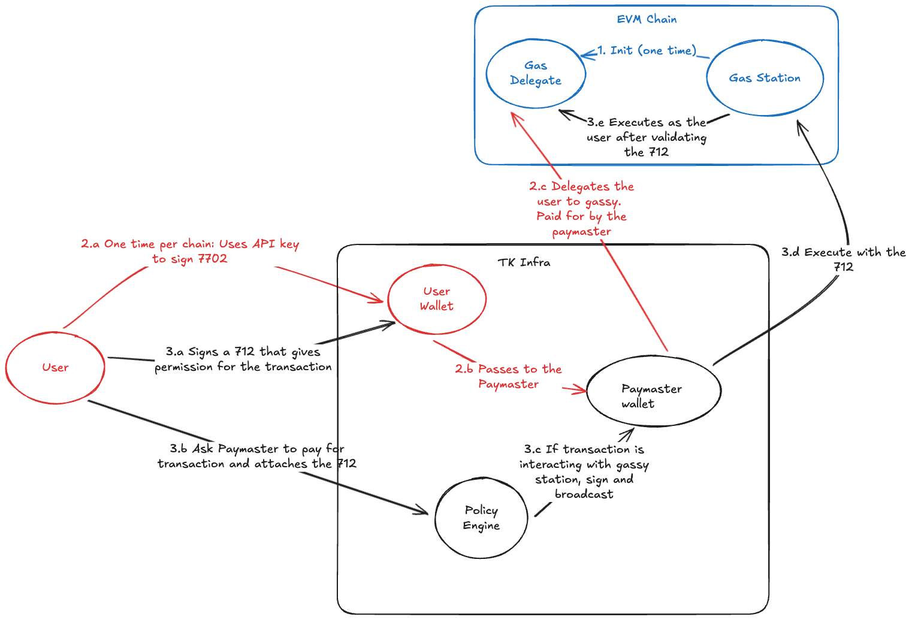

TK Gas Station lets a user have all their gas paid for by another party using metatransactions.

## Deployments V1.1

All contracts are deployed at the same address across all networks:
- **TKGasStation**: `0x1cBBD58E521e1133F09E2Ba207e3e75c4DB404D5`
- **TKGasDelegate**: `0x2a31eF110e4Cdb9C332aA1d8633510214299c48B`

#### Ethereum Mainnet
- **TKGasStation**: [0x1cBBD58E521e1133F09E2Ba207e3e75c4DB404D5](https://etherscan.io/address/0x1cBBD58E521e1133F09E2Ba207e3e75c4DB404D5)
- **TKGasDelegate**: [0x2a31eF110e4Cdb9C332aA1d8633510214299c48B](https://etherscan.io/address/0x2a31eF110e4Cdb9C332aA1d8633510214299c48B)

#### Sepolia Testnet
- **TKGasStation**: [0x1cBBD58E521e1133F09E2Ba207e3e75c4DB404D5](https://sepolia.etherscan.io/address/0x1cBBD58E521e1133F09E2Ba207e3e75c4DB404D5)
- **TKGasDelegate**: [0x2a31eF110e4Cdb9C332aA1d8633510214299c48B](https://sepolia.etherscan.io/address/0x2a31eF110e4Cdb9C332aA1d8633510214299c48B)

#### Base Mainnet
- **TKGasStation**: [0x1cBBD58E521e1133F09E2Ba207e3e75c4DB404D5](https://basescan.org/address/0x1cBBD58E521e1133F09E2Ba207e3e75c4DB404D5)
- **TKGasDelegate**: [0x2a31eF110e4Cdb9C332aA1d8633510214299c48B](https://basescan.org/address/0x2a31eF110e4Cdb9C332aA1d8633510214299c48B)

#### Polygon Mainnet
- **TKGasStation**: [0x1cBBD58E521e1133F09E2Ba207e3e75c4DB404D5](https://polygonscan.com/address/0x1cBBD58E521e1133F09E2Ba207e3e75c4DB404D5)
- **TKGasDelegate**: [0x2a31eF110e4Cdb9C332aA1d8633510214299c48B](https://polygonscan.com/address/0x2a31eF110e4Cdb9C332aA1d8633510214299c48B)

#### Celo Mainnet
- **TKGasStation**: [0x1cBBD58E521e1133F09E2Ba207e3e75c4DB404D5](https://celoscan.io/address/0x1cBBD58E521e1133F09E2Ba207e3e75c4DB404D5)
- **TKGasDelegate**: [0x2a31eF110e4Cdb9C332aA1d8633510214299c48B](https://celoscan.io/address/0x2a31eF110e4Cdb9C332aA1d8633510214299c48B)

#### Arbitrum One
- **TKGasStation**: [0x1cBBD58E521e1133F09E2Ba207e3e75c4DB404D5](https://arbiscan.io/address/0x1cBBD58E521e1133F09E2Ba207e3e75c4DB404D5)
- **TKGasDelegate**: [0x2a31eF110e4Cdb9C332aA1d8633510214299c48B](https://arbiscan.io/address/0x2a31eF110e4Cdb9C332aA1d8633510214299c48B)

#### Optimism
- **TKGasStation**: [0x1cBBD58E521e1133F09E2Ba207e3e75c4DB404D5](https://optimistic.etherscan.io/address/0x1cBBD58E521e1133F09E2Ba207e3e75c4DB404D5)
- **TKGasDelegate**: [0x2a31eF110e4Cdb9C332aA1d8633510214299c48B](https://optimistic.etherscan.io/address/0x2a31eF110e4Cdb9C332aA1d8633510214299c48B)

#### Monad Mainnet
- **TKGasStation**: [0x1cBBD58E521e1133F09E2Ba207e3e75c4DB404D5](https://monadscan.com/address/0x1cBBD58E521e1133F09E2Ba207e3e75c4DB404D5)
- **TKGasDelegate**: [0x2a31eF110e4Cdb9C332aA1d8633510214299c48B](https://monadscan.com/address/0x2a31eF110e4Cdb9C332aA1d8633510214299c48B)

#### Arc Testnet
- **TKGasStation**: [0x1cBBD58E521e1133F09E2Ba207e3e75c4DB404D5](https://testnet.arcscan.app/address/0x1cBBD58E521e1133F09E2Ba207e3e75c4DB404D5)
- **TKGasDelegate**: [0x2a31eF110e4Cdb9C332aA1d8633510214299c48B](https://testnet.arcscan.app/address/0x2a31eF110e4Cdb9C332aA1d8633510214299c48B)

#### Bnb Mainnet
- **TKGasStation**: [0x1cBBD58E521e1133F09E2Ba207e3e75c4DB404D5](https://bscscan.com/address/0x1cBBD58E521e1133F09E2Ba207e3e75c4DB404D5)
- **TKGasDelegate**: [0x2a31eF110e4Cdb9C332aA1d8633510214299c48B](https://bscscan.com/address/0x2a31eF110e4Cdb9C332aA1d8633510214299c48B)

#### Bnb Testnet
- **TKGasStation**: [0x1cBBD58E521e1133F09E2Ba207e3e75c4DB404D5](https://bscscan.com/address/0x1cBBD58E521e1133F09E2Ba207e3e75c4DB404D5)
- **TKGasDelegate**: [0x2a31eF110e4Cdb9C332aA1d8633510214299c48B](https://bscscan.com/address/0x2a31eF110e4Cdb9C332aA1d8633510214299c48B)


## Overall Flow
1. The user signs a type 4 transaction to delegate access to TKGasDelegate (EIP-7702). This can be broadcasted by the paymaster
2. The user then signs a metatransaction (EIP-712) to give permissions to the paymaster to initiate a transaction on behalf of the user
3. The paymaster then submits the metatransaction to the TKGasStation


## Security Design Decisions
* Contracts are immutable
* There are no re-entry protections by design. Re-entrancy should be guarded by the contracts the user is interacting with (as in a normal EoA)
    - The nonce for execute and batch execute will naturally protect against re-entrancy, but this should not be relied upon 
    - There is no built in re-entrancy protection for session based auth since it is meant to be replayed
* Both the delegate and the gas station are not using DRY. This is a purpsoseful design choice to save gas during run time
* Paymasters (and anyone else) can interact with TKGasDelegate through the TKGasStation or directly through the delegate itself
* The gas station has helper external functions for hashing for the type hash. This is just to help for external development and testing, and are not used during execution
* There are session metatransactions that give one particular wallet unlimited execution on behalf of a user
    - This is a footgun and should be used carefully
    - This limits to only one wallet in the typehash
    - Each one has a counter 
    - Multiple signatures (sessions) can be on a single counter
    - The counter is non sequential
    - The purpose of the counter is to act as a "log out" functionality to expire the session before the deadline - Burning this will invalidate all signatures with that counter 
* The standard execution metatransactions should limit by nonce, deadline, interacting contract, and arguments
* Batch transactions for standard execution should share one nonce per batch and one signature that includes the whole batch
* For session batch execution, only the session limitations of sender, counter, and deadline are verified. Not the batch
* All execute will revert if it gets a failure. Anything interacting with the gas station should be able to handle that
* Batch transactions are capped at 20 per batch currently
* Burning a nonce only burns the current nonce. Ones that are premade will be valid
* Nonces are sequential and can only be used sequentially
* A user can burn their own counter or nonce without a 712
* The gas delegate implements recievers for ERC-721 and ERC-1155
* The Gas station cannot use session based auth. This is because authorizing the gas station to send arbitrary messages would enable anyone to send arbitrary messages through the gas station
* There is no requirement for the paymaster to interact with the gas station. The paymaster can interact with the delegate directly if they trust that the user is using the right delegate by doing off-chain validation. 
* The delegate does not implement EIP-7821[https://eips.ethereum.org/EIPS/eip-7821] as described since the execute function is _payable_. As a security measure to not drain the paymaster, no execute functions by design are allowed to be payable
* An attack that can be pulled off to reset/modify the nonce/counters is as follows:
    1. A user delegates and uses it as normal. The nonce iterates up
    2. The user then delegates to a contract that changes the nonce or resets it to 0 since that storage slot stays with the user's address, not the delegated contract
    3. The user then delegates back to TKGasDelegate
    4. Since the nonce is reset, old transactions can be replayed.
    This is accepted because we have a deadline transactions and on step 2, if you delegate to a malicious contract the attacker already has control.  

## Packing data for calling the fallback function in the delegate

The fall back function can call the execute and session execution functions. It does not call the burn functions 

To use it:
The first byte should be a null byte 0x00. No function selector in the delegate or the gas station starts with a null byte, so there would be no name collision. The gas station will just parse the target contract and then call the delegate fall back function. 
The second byte is a combination of the first nibble that acts as the function selector and the second nibble that acts as a boolean that says whether or not to return values or not
The eth value is 10 bytes, a uint80

Function selectors without to return or not:
* 00 - Execute
* 10 - ApproveThenExecute
* 20 - ExecuteBatch
* 30 - ExecuteSession
* 40 - ExecuteBatchSession
* 50 - ExecuteArbitrarySession
* 60 - ExecuteBatchArbitrarySession

For example, a normal execute with no return would be 0x00. A normal execute with a return would be 0x01. 

# Reporting A Vulnerability/Bug Bounty

See our documentation[https://docs.turnkey.com/security/reporting-a-vulnerability] about our bug bounty program.


# Deployment

All contracts are deployed with the create2 factory with the zero address as the deployer
Anyone can canonically deploy this to a new network

The deploy scripts have the salt for bot the delegate and the gas station purposefully hardcoded 

The delegate should be deployed before the gas station

If you are deploying to a chain where `0x0000000000FFe8B47B3e2130213B802212439497` does not exist yet, you must deploy 0age's `ImmutableCreate2Factory` on that chain first. Otherwise the scripts will revert because `safeCreate2` is being called on an address with no code.


1. Install Foundry if you haven't already
Go to https://getfoundry.sh/introduction/installation/ and install if needed 


2. Clone the repo and checkout the version

```
git clone https://github.com/tkhq/gas-station.git

cd gas-station

git checkout v1.0.0

```

3. Add the RPC configuration to the foundry.toml

Fill ```<networkName>``` with your desired network name. I.e. Base

```
[rpc_endpoints]
<networkName> = "<PUBLIC-RPC-URL>

[etherscan]
<networkName> = { key = "${ETHERSCAN_API_KEY}", url = "<NETWORK-ETHERSCAN-URL>" }
```


4. Create an .env file, and add your private key and etherscan API key
Create the file
```
cp ./env.example ./.env
```

In the file add your keys:
```
PRIVATE_KEY=your_private_key_here

# API Key for contract verification (works for both Base and Ethereum)
ETHERSCAN_API_KEY=your_etherscan_api_key_here
```


5. Install and deploy

``` 
cd ./gas-station

forge install

forge build

forge script script/DeployTKGasDelegate.s.sol:DeployTKGasDelegate --rpc-url <NETWORK-NAME> --broadcast --verify

forge script script/DeployTKGasStation.s.sol:DeployTKGasStation --rpc-url <NETWORK-NAME> --broadcast --verify
``` 

### Arc Mainnet

Arc mainnet is configured as `arc` and reads its RPC URL from `ARC_RPC_URL`.

Before broadcasting, verify that the configured RPC is Arc mainnet:

```
cast chain-id --rpc-url "$ARC_RPC_URL"
```

For Circle Arc via Alchemy, this must return `5042`. Do not use chain ID `1243` unless you intend to deploy to the separate ARC / Archie Chain network.

If the immutable create2 factory is not deployed yet on Arc mainnet, deploy it first:

```
export ARC_RPC_URL="$(sed -n 's/^ARC_RPC_URL=//p' .env)"
export PRIVATE_KEY="$(sed -n 's/^PRIVATE_KEY=//p' .env)"

cast send --rpc-url "$ARC_RPC_URL" --private-key "$PRIVATE_KEY" --value 0.01ether 0x4c8D290a1B368ac4728d83a9e8321fC3af2b39b1

cast publish --rpc-url "$ARC_RPC_URL" 0xf87e8085174876e800830186a08080ad601f80600e600039806000f350fe60003681823780368234f58015156014578182fd5b80825250506014600cf31ba02222222222222222222222222222222222222222222222222222222222222222a02222222222222222222222222222222222222222222222222222222222222222

cast send --rpc-url "$ARC_RPC_URL" --private-key "$PRIVATE_KEY" 0x7a0d94f55792c434d74a40883c6ed8545e406d12 0x608060405234801561001057600080fd5b50610833806100206000396000f3fe60806040526004361061003f5760003560e01c806308508b8f1461004457806364e030871461009857806385cf97ab14610138578063a49a7c90146101bc575b600080fd5b34801561005057600080fd5b506100846004803603602081101561006757600080fd5b503573ffffffffffffffffffffffffffffffffffffffff166101ec565b604080519115158252519081900360200190f35b61010f600480360360408110156100ae57600080fd5b813591908101906040810160208201356401000000008111156100d057600080fd5b8201836020820111156100e257600080fd5b8035906020019184600183028401116401000000008311171561010457600080fd5b509092509050610217565b6040805173ffffffffffffffffffffffffffffffffffffffff9092168252519081900360200190f35b34801561014457600080fd5b5061010f6004803603604081101561015b57600080fd5b8135919081019060408101602082013564010000000081111561017d57600080fd5b82018360208201111561018f57600080fd5b803590602001918460018302840111640100000000831117156101b157600080fd5b509092509050610592565b3480156101c857600080fd5b5061010f600480360360408110156101df57600080fd5b508035906020013561069e565b73ffffffffffffffffffffffffffffffffffffffff1660009081526020819052604090205460ff1690565b600083606081901c33148061024c57507fffffffffffffffffffffffffffffffffffffffff0000000000000000000000008116155b6102a1576040517f08c379a00000000000000000000000000000000000000000000000000000000081526004018080602001828103825260458152602001806107746045913960600191505060405180910390fd5b606084848080601f0160208091040260200160405190810160405280939291908181526020018383808284376000920182905250604051855195965090943094508b93508692506020918201918291908401908083835b6020831061033557805182527fffffffffffffffffffffffffffffffffffffffffffffffffffffffffffffffe090920191602091820191016102f8565b51815160209384036101000a7fffffffffffffffffffffffffffffffffffffffffffffffffffffffffffffffff018019909216911617905260408051929094018281037fffffffffffffffffffffffffffffffffffffffffffffffffffffffffffffffe00183528085528251928201929092207fff000000000000000000000000000000000000000000000000000000000000008383015260609890981b7fffffffffffffffffffffffffffffffffffffffff00000000000000000000000016602183015260358201969096526055808201979097528251808203909701875260750182525084519484019490942073ffffffffffffffffffffffffffffffffffffffff81166000908152938490529390922054929350505060ff16156104a7576040517f08c379a000000000000000000000000000000000000000000000000000000000815260040180806020018281038252603f815260200180610735603f913960400191505060405180910390fd5b81602001825188818334f5955050508073ffffffffffffffffffffffffffffffffffffffff168473ffffffffffffffffffffffffffffffffffffffff161461053a576040517f08c379a00000000000000000000000000000000000000000000000000000000081526004018080602001828103825260468152602001806107b96046913960600191505060405180910390fd5b50505073ffffffffffffffffffffffffffffffffffffffff8116600090815260208190526040902080547fffffffffffffffffffffffffffffffffffffffffffffffffffffffffffffff001660011790559392505050565b6000308484846040516020018083838082843760408051919093018181037fffffffffffffffffffffffffffffffffffffffffffffffffffffffffffffffe001825280845281516020928301207fff000000000000000000000000000000000000000000000000000000000000008383015260609990991b7fffffffffffffffffffffffffffffffffffffffff000000000000000000000000166021820152603581019790975260558088019890985282518088039098018852607590960182525085519585019590952073ffffffffffffffffffffffffffffffffffffffff81166000908152948590529490932054939450505060ff909116159050610697575060005b9392505050565b604080517fff000000000000000000000000000000000000000000000000000000000000006020808301919091523060601b6021830152603582018590526055808301859052835180840390910181526075909201835281519181019190912073ffffffffffffffffffffffffffffffffffffffff81166000908152918290529190205460ff161561072e575060005b9291505056fe496e76616c696420636f6e7472616374206372656174696f6e202d20636f6e74726163742068617320616c7265616479206265656e206465706c6f7965642e496e76616c69642073616c74202d206669727374203230206279746573206f66207468652073616c74206d757374206d617463682063616c6c696e6720616464726573732e4661696c656420746f206465706c6f7920636f6e7472616374207573696e672070726f76696465642073616c7420616e6420696e697469616c697a6174696f6e20636f64652ea265627a7a723058202bdc55310d97c4088f18acf04253db593f0914059f0c781a9df3624dcef0d1cf64736f6c634300050a0032

cast send --rpc-url "$ARC_RPC_URL" --private-key "$PRIVATE_KEY" 0xcfa3a7637547094ff06246817a35b8333c315196 0x64e030870000000000000000000000000000000000000000f4b0218f13a6440a6f02000000000000000000000000000000000000000000000000000000000000000000400000000000000000000000000000000000000000000000000000000000000853608060405234801561001057600080fd5b50610833806100206000396000f3fe60806040526004361061003f5760003560e01c806308508b8f1461004457806364e030871461009857806385cf97ab14610138578063a49a7c90146101bc575b600080fd5b34801561005057600080fd5b506100846004803603602081101561006757600080fd5b503573ffffffffffffffffffffffffffffffffffffffff166101ec565b604080519115158252519081900360200190f35b61010f600480360360408110156100ae57600080fd5b813591908101906040810160208201356401000000008111156100d057600080fd5b8201836020820111156100e257600080fd5b8035906020019184600183028401116401000000008311171561010457600080fd5b509092509050610217565b6040805173ffffffffffffffffffffffffffffffffffffffff9092168252519081900360200190f35b34801561014457600080fd5b5061010f6004803603604081101561015b57600080fd5b8135919081019060408101602082013564010000000081111561017d57600080fd5b82018360208201111561018f57600080fd5b803590602001918460018302840111640100000000831117156101b157600080fd5b509092509050610592565b3480156101c857600080fd5b5061010f600480360360408110156101df57600080fd5b508035906020013561069e565b73ffffffffffffffffffffffffffffffffffffffff1660009081526020819052604090205460ff1690565b600083606081901c33148061024c57507fffffffffffffffffffffffffffffffffffffffff0000000000000000000000008116155b6102a1576040517f08c379a00000000000000000000000000000000000000000000000000000000081526004018080602001828103825260458152602001806107746045913960600191505060405180910390fd5b606084848080601f0160208091040260200160405190810160405280939291908181526020018383808284376000920182905250604051855195965090943094508b93508692506020918201918291908401908083835b6020831061033557805182527fffffffffffffffffffffffffffffffffffffffffffffffffffffffffffffffe090920191602091820191016102f8565b51815160209384036101000a7fffffffffffffffffffffffffffffffffffffffffffffffffffffffffffffffff018019909216911617905260408051929094018281037fffffffffffffffffffffffffffffffffffffffffffffffffffffffffffffffe00183528085528251928201929092207fff000000000000000000000000000000000000000000000000000000000000008383015260609890981b7fffffffffffffffffffffffffffffffffffffffff00000000000000000000000016602183015260358201969096526055808201979097528251808203909701875260750182525084519484019490942073ffffffffffffffffffffffffffffffffffffffff81166000908152938490529390922054929350505060ff16156104a7576040517f08c379a000000000000000000000000000000000000000000000000000000000815260040180806020018281038252603f815260200180610735603f913960400191505060405180910390fd5b81602001825188818334f5955050508073ffffffffffffffffffffffffffffffffffffffff168473ffffffffffffffffffffffffffffffffffffffff161461053a576040517f08c379a00000000000000000000000000000000000000000000000000000000081526004018080602001828103825260468152602001806107b96046913960600191505060405180910390fd5b50505073ffffffffffffffffffffffffffffffffffffffff8116600090815260208190526040902080547fffffffffffffffffffffffffffffffffffffffffffffffffffffffffffffff001660011790559392505050565b6000308484846040516020018083838082843760408051919093018181037fffffffffffffffffffffffffffffffffffffffffffffffffffffffffffffffe001825280845281516020928301207fff000000000000000000000000000000000000000000000000000000000000008383015260609990991b7fffffffffffffffffffffffffffffffffffffffff000000000000000000000000166021820152603581019790975260558088019890985282518088039098018852607590960182525085519585019590952073ffffffffffffffffffffffffffffffffffffffff81166000908152948590529490932054939450505060ff909116159050610697575060005b9392505050565b604080517fff000000000000000000000000000000000000000000000000000000000000006020808301919091523060601b6021830152603582018590526055808301859052835180840390910181526075909201835281519181019190912073ffffffffffffffffffffffffffffffffffffffff81166000908152918290529190205460ff161561072e575060005b9291505056fe496e76616c696420636f6e7472616374206372656174696f6e202d20636f6e74726163742068617320616c7265616479206265656e206465706c6f7965642e496e76616c69642073616c74202d206669727374203230206279746573206f66207468652073616c74206d757374206d617463682063616c6c696e6720616464726573732e4661696c656420746f206465706c6f7920636f6e7472616374207573696e672070726f76696465642073616c7420616e6420696e697469616c697a6174696f6e20636f64652ea265627a7a723058202bdc55310d97c4088f18acf04253db593f0914059f0c781a9df3624dcef0d1cf64736f6c634300050a003200000000000000000000000000
```

Then deploy the Gas Delegate first, followed by the Gas Station:

```
TK_GAS_DELEGATE=0x2a31eF110e4Cdb9C332aA1d8633510214299c48B forge script script/DeployTKGasDelegate.s.sol:DeployTKGasDelegate --rpc-url arc --broadcast

TK_GAS_DELEGATE=0x2a31eF110e4Cdb9C332aA1d8633510214299c48B forge script script/DeployTKGasStation.s.sol:DeployTKGasStation --rpc-url arc --broadcast
```


6. Add the contract addresses to the readme
